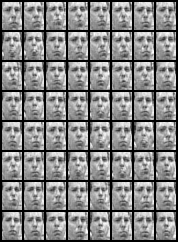
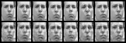

# VAE
Variational Autoencoder for generating faces similar to frey face dataset.  
Autoencoders are neural nets that learn to encode image into f.ex. 10-dimensional vector and then decode from this vector back to original image.
Variational Autoencoders guarantee probability distribution of this 10-D space, which allows for generating new images.  

This VAE learns on 2000 face images of Brendan Frey and generates new ones.

### Some generated faces:

### Original / encoded-decoded comparison

